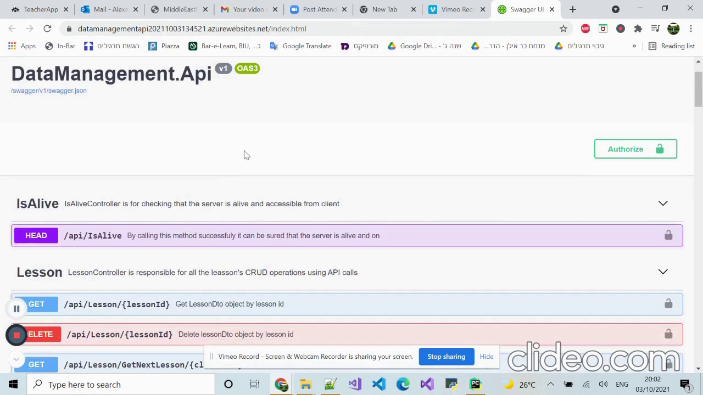

# TheBackEyeDataManagement

Web API Server for TheBackEye app

**Architecture**

* It's built using C# version 8.0 with the .NET Core framework 5.0 as cross-platform framework.
* Restful web APIs provide access to DB data using Bearer tokens for authentication.
* Entity Frame Core is used to communicate between the web API server and the SQL database.
* Microsoft Azure cloud is used for hosting both: the web API server and SQL database.
* Swagger UI provides comprehensive documentation for each API as well as a testing tool.
* SignalR provides real-time web functionality to send new measurement data to registered clients (the web application). 

**DB Relations**

**Snapshots**

